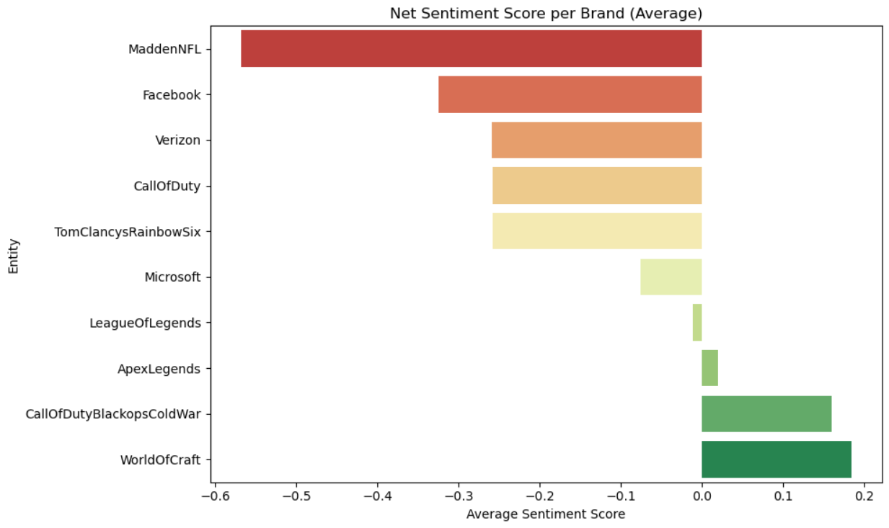

#  Task 3 – Twitter Sentiment Analysis

This project analyzes sentiment-based text data from Twitter. It focuses on cleaning raw tweet data, visualizing word frequency patterns, and calculating sentiment scores for top-mentioned brands.

---

## Tech Stack & Libraries

- **Python 3.x**
- **Jupyter Notebook**
- **pandas**
- **seaborn**
- **matplotlib**
- **nltk**
- **wordcloud**
- **re, string, collections**

---

## Files Used

- Dataset used: `twitter_training.csv`:  
  Contains 4 columns – `ID`, `Entity`, `Sentiment`, and `Tweet`.

---

## Data Cleaning & Preprocessing

- Removed:
  - URLs, hashtags, mentions, and punctuation
  - Extra whitespaces and digits
- Converted text to lowercase
- Removed stopwords using `nltk` and `wordcloud` libraries
- Applied **lemmatization** using `WordNetLemmatizer` to normalize the words

---

## Visualizations

> **Note:** The notebook contains 11 visualizations in total, including bar charts and word clouds for each sentiment category.  
> Below is a sample preview of just one:

### Net Sentiment Score per Brand


---

## Insights

## Key Insights from Twitter Sentiment Analysis

- **Gaming Dominates**: The word **"game"** appeared over 8,000 times — proving the dataset is heavily skewed toward the gaming community.

- **Play = Engagement**: Frequent use of **"play"**, **"update"**, **"patch"**, and **"server"** reflects active gameplay and user frustration during technical issues.

- **Sentiment Vocabulary**:
  - Positive: **love**, **awesome**, **good** (feature praise, excitement).
  - Negative: **crash**, **fail**, **not working** (bugs, server issues).
  - Neutral: **release**, **update**, **feature** (official news/posts).

- **Emotional Tone**: Frequent words like **"I"**, **"my"**, and **"you"** show tweets are personal, not generic — users feel emotionally connected to brands.

- **Top Brand Sentiment**:
  -  **Microsoft**: Most positive.
  -  **Facebook**: Most negative.
  -  **LeagueOfLegends**: Most neutral.
  -  **TomClancysRainbowSix**: Most mentioned overall.


## How to Run

1. Clone the repository or download the `.ipynb` notebook and `twitter_training.csv` file.
2. Install the required libraries using pip:

   ```bash
   pip install pandas matplotlib seaborn nltk wordcloud
